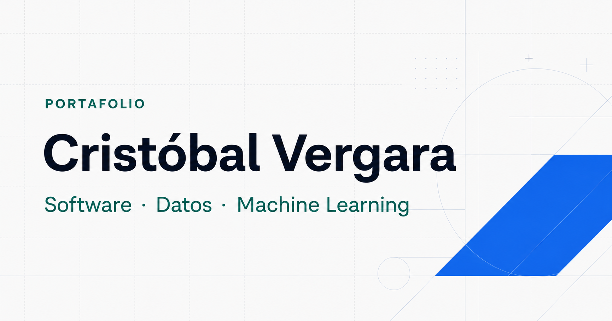

# Portafolio de Cristóbal Vergara

[](https://github.com/xSkyLiN3/portfolio-web/actions/workflows/ci.yml)

Web personal y CV profesional de [Cristóbal Vergara](https://nightstrike.cloud), estudiante de Ingeniería en Informática con una demo pública de machine learning, proyectos propios de software y una dirección de aprendizaje hacia AI/ML Engineering.



## Enfoque

El sitio está diseñado para presentar evidencia sin exagerar el nivel profesional actual:

- AI/ML se comunica como dirección profesional en desarrollo, no como cargo alcanzado.
- Machine Failure Risk Classifier es el proyecto principal: demo pública, código, Model Card y release verificables.
- Sus métricas se presentan junto a su contexto: holdout final reservado de 2.000 filas y dataset sintético sin validación industrial.
- Operación Control aparece como piloto privado.
- Weapon Inspector aparece como proyecto histórico secundario con código y release públicos.
- No se publican accesos internos, teléfono, RUT, dirección ni datos operativos.

## Contenido

- Presentación y posicionamiento profesional.
- Estado real de tres proyectos propios.
- Caso de estudio verificable del proyecto principal, con metodología, resultados y límites.
- Trayectoria desde fundamentos de software hacia datos y machine learning.
- Tecnologías agrupadas por evidencia de uso.
- Formación universitaria y credencial pública de Kaggle.
- CV de una página, descargable y compatible con ATS.
- Contacto mediante correo, LinkedIn y GitHub.

## Stack

- React 19
- TypeScript
- vinext y Vite
- CSS responsivo sin librerías de componentes
- GitHub Actions para compilación y pruebas

## Desarrollo local

Requiere Node.js 22.13 o superior.

```bash
npm ci
npm run dev
```

La aplicación queda disponible en `http://localhost:3000`.

## Verificación

```bash
npm test
npm run lint
```

Las pruebas compilan el sitio, renderizan la portada y el caso de estudio, y comprueban el contenido profesional, los metadatos, la ausencia de datos sensibles y los recursos públicos.

Para producir el paquete estático usado por el VPS:

```bash
npm run export:static
```

El resultado se genera en `deploy/`. El sitio público no necesita Node.js, base de datos ni un proceso de aplicación en el servidor.

El destino canónico es el VPS en `nightstrike.cloud`, publicado como una release estática e inmutable. La configuración de OpenAI Sites se conserva para compatibilidad de desarrollo, pero no sustituye el dominio principal.

## Generar el CV

El archivo público está en `public/CV_Cristobal_Vergara.pdf`. La fuente reproducible utiliza ReportLab:

```bash
python scripts/create_cv.py
```

Después de generarlo, el PDF debe revisarse visualmente antes de reemplazar la versión publicada.

## Estructura principal

```text
app/                 página, layout y sistema visual
public/              fotografía, CV, favicon y tarjeta social
scripts/             generador reproducible del CV
tests/               comprobaciones del HTML renderizado
.openai/hosting.json configuración de publicación
```

## Licencia y contenido personal

El código fuente se publica bajo licencia MIT. La fotografía, el CV, los textos biográficos y demás contenido personal no forman parte de esa licencia y no pueden reutilizarse para suplantación, entrenamiento de perfiles o representación de otra persona.
